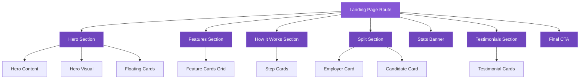
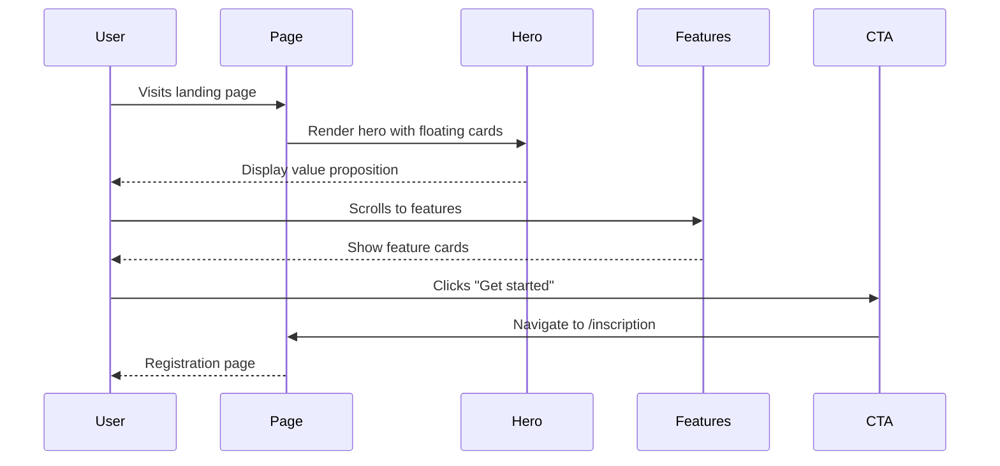

# Design Document: Premium Landing Page Redesign

## Overview

This design transforms the HandiTalents landing page into a premium SaaS experience inspired by award-winning startup designs. The redesign focuses on rounded hero containers with soft purple gradients, floating card aesthetics, premium typography, elegant spacing, and modern visual hierarchy. The implementation leverages Next.js App Router, React, TypeScript, and Tailwind CSS to create a polished, accessible, and performant landing experience.

## Architecture



## Main Workflow



## Design System

### Color Palette

```typescript
const colors = {
  // Background gradients
  bg: {
    primary: '#f7f4ff',
    soft: '#f4edff',
    white: '#ffffff',
  },
  
  // Purple scale
  purple: {
    900: '#3b1d72',
    800: '#4e2b91',
    700: '#6f45be',
    600: '#8657d6',
    200: '#d8c5ff',
  },
  
  // Text colors
  text: {
    primary: '#1f1736',
    muted: '#6c5f8f',
  },
  
  // Utility
  border: 'rgba(83, 49, 145, 0.14)',
}
```

### Typography Scale

```typescript
const typography = {
  fonts: {
    heading: '"Outfit", "Segoe UI", sans-serif',
    body: '"Plus Jakarta Sans", "Segoe UI", sans-serif',
  },
  
  sizes: {
    hero: 'clamp(2.15rem, 4.8vw, 4rem)',
    h2: 'clamp(1.8rem, 3.2vw, 2.8rem)',
    h3: 'clamp(1.5rem, 2.6vw, 2rem)',
    body: '1rem',
    small: '0.9rem',
    tiny: '0.74rem',
  },
  
  weights: {
    regular: 400,
    medium: 500,
    semibold: 600,
    bold: 700,
    extrabold: 800,
  },
}
```

### Border Radius Scale

```typescript
const borderRadius = {
  xl: '52px',
  lg: '30px',
  md: '22px',
  sm: '16px',
  full: '999px',
}
```

### Shadow Scale

```typescript
const shadows = {
  soft: '0 16px 40px rgba(75, 38, 141, 0.1)',
  mid: '0 24px 60px rgba(66, 33, 126, 0.18)',
  strong: '0 34px 90px rgba(47, 21, 93, 0.3)',
}
```

### Spacing System

```typescript
const spacing = {
  xs: '8px',
  sm: '12px',
  md: '16px',
  lg: '24px',
  xl: '34px',
  '2xl': '48px',
  '3xl': '58px',
}
```

## Components and Interfaces

### Component 1: TopBar

**Purpose**: Display contact information in a premium gradient bar

**Interface**:
```typescript
interface TopBarProps {
  email: string
  phone: string
}
```

**Responsibilities**:
- Display contact links with hover effects
- Apply purple gradient background
- Maintain responsive layout

### Component 2: Navbar

**Purpose**: Sticky navigation with glassmorphism effect

**Interface**:
```typescript
interface NavbarProps {
  logoSrc: string
  logoAlt: string
  menuItems: MenuItem[]
  loginHref: string
  ctaHref: string
}

interface MenuItem {
  label: string
  href: string
  active?: boolean
}
```

**Responsibilities**:
- Sticky positioning with backdrop blur
- Responsive menu layout
- Active state indication
- CTA button prominence

### Component 3: HeroSection

**Purpose**: Main hero with rounded container, gradient background, and floating cards

**Interface**:
```typescript
interface HeroSectionProps {
  badge: string
  title: string
  highlightText: string
  description: string
  primaryCta: CtaButton
  secondaryCta: CtaButton
  trustBadges: string[]
  heroImage: string
  floatingCards: FloatingCard[]
}

interface CtaButton {
  label: string
  href: string
}

interface FloatingCard {
  type: 'match' | 'stats' | 'progress'
  position: 'top' | 'right' | 'bottom'
  content: Record<string, any>
}
```

**Responsibilities**:
- Render rounded hero container with gradient
- Position floating cards with glassmorphism
- Apply decorative background blobs
- Responsive grid layout

### Component 4: FeatureCard

**Purpose**: Individual feature card with hover animation

**Interface**:
```typescript
interface FeatureCardProps {
  title: string
  description: string
  icon?: React.ReactNode
}
```

**Responsibilities**:
- Display feature with icon
- Hover lift animation
- Consistent card styling

### Component 5: StepCard

**Purpose**: Process step card with numbered badge

**Interface**:
```typescript
interface StepCardProps {
  step: string
  title: string
  description: string
  showArrow?: boolean
}
```

**Responsibilities**:
- Display numbered step badge
- Show mini preview visualization
- Connect steps with arrows

### Component 6: SplitCard

**Purpose**: Large promotional card for employers/candidates

**Interface**:
```typescript
interface SplitCardProps {
  variant: 'employer' | 'candidate'
  kicker: string
  title: string
  description: string
  floatingBadge: string
}
```

**Responsibilities**:
- Apply variant-specific styling
- Render dashboard preview
- Position floating badge

### Component 7: TestimonialCard

**Purpose**: User testimonial with photo and quote

**Interface**:
```typescript
interface TestimonialCardProps {
  photo: string
  quote: string
  name: string
  role: string
}
```

**Responsibilities**:
- Display user photo with border
- Format quote text
- Show attribution

## Data Models

### Model 1: Feature

```typescript
interface Feature {
  title: string
  text: string
}
```

**Validation Rules**:
- `title` must be non-empty string (max 60 characters)
- `text` must be non-empty string (max 200 characters)

### Model 2: HowStep

```typescript
interface HowStep {
  step: string
  title: string
  text: string
}
```

**Validation Rules**:
- `step` must be numeric string ("1", "2", etc.)
- `title` must be non-empty string (max 40 characters)
- `text` must be non-empty string (max 150 characters)

### Model 3: Stat

```typescript
interface Stat {
  value: string
  label: string
}
```

**Validation Rules**:
- `value` must be non-empty string (e.g., "20,000+")
- `label` must be non-empty string (max 30 characters)

### Model 4: Testimonial

```typescript
interface Testimonial {
  photo: string
  quote: string
  name: string
  role: string
}
```

**Validation Rules**:
- `photo` must be valid image path
- `quote` must be non-empty string (max 300 characters)
- `name` must be non-empty string (max 50 characters)
- `role` must be non-empty string (max 50 characters)

## Key Functions with Formal Specifications

### Function 1: renderHeroSection()

```typescript
function renderHeroSection(props: HeroSectionProps): JSX.Element
```

**Preconditions:**
- `props` is non-null and well-formed
- `props.heroImage` is valid image path
- `props.floatingCards` is non-empty array

**Postconditions:**
- Returns valid JSX.Element
- Hero container has rounded corners (52px)
- Gradient background applied correctly
- Floating cards positioned absolutely
- Responsive grid layout applied

**Loop Invariants:** N/A

### Function 2: applyGlassmorphism()

```typescript
function applyGlassmorphism(opacity: number): string
```

**Preconditions:**
- `opacity` is number between 0 and 1

**Postconditions:**
- Returns CSS class string
- Applies backdrop-filter blur
- Sets background with specified opacity
- Adds border with transparency

**Loop Invariants:** N/A

### Function 3: calculateFloatingCardPosition()

```typescript
function calculateFloatingCardPosition(
  type: FloatingCard['type'],
  containerDimensions: Dimensions
): Position
```

**Preconditions:**
- `type` is one of: 'match', 'stats', 'progress'
- `containerDimensions` has valid width and height

**Postconditions:**
- Returns Position object with top, right, bottom, left values
- Position ensures card stays within container bounds
- Position creates visual balance

**Loop Invariants:** N/A

## Algorithmic Pseudocode

### Main Rendering Algorithm

```pascal
ALGORITHM renderLandingPage()
OUTPUT: Complete landing page JSX

BEGIN
  // Initialize page structure
  page ← createPageContainer()
  
  // Render navigation
  topBar ← renderTopBar(contactInfo)
  navbar ← renderNavbar(navConfig)
  page.append(topBar, navbar)
  
  // Render main sections in order
  sections ← [
    renderHeroSection(heroData),
    renderFeaturesSection(features),
    renderHowItWorksSection(steps),
    renderSplitSection(splitData),
    renderStatsBanner(stats),
    renderTestimonialsSection(testimonials),
    renderFinalCTA(ctaData)
  ]
  
  FOR each section IN sections DO
    page.append(section)
  END FOR
  
  // Render footer
  footer ← renderFooter(footerData)
  page.append(footer)
  
  RETURN page
END
```

**Preconditions:**
- All data objects (heroData, features, etc.) are validated
- Image assets are available
- Tailwind CSS is configured

**Postconditions:**
- Complete landing page structure returned
- All sections rendered in correct order
- Responsive design applied
- Accessibility attributes included

### Floating Card Positioning Algorithm

```pascal
ALGORITHM positionFloatingCards(cards, containerBounds)
INPUT: cards (array of FloatingCard), containerBounds (Dimensions)
OUTPUT: positioned cards with absolute coordinates

BEGIN
  positionedCards ← []
  
  FOR each card IN cards DO
    CASE card.type OF
      'match':
        position ← {top: -8, right: 8, width: 220}
      'stats':
        position ← {right: -12, top: 182, width: 248}
      'progress':
        position ← {left: 64, bottom: -6, width: 260}
    END CASE
    
    // Ensure card stays within bounds
    IF position.right AND position.right + position.width > containerBounds.width THEN
      position.right ← containerBounds.width - position.width - 16
    END IF
    
    IF position.left AND position.left + position.width > containerBounds.width THEN
      position.left ← 16
    END IF
    
    card.position ← position
    positionedCards.add(card)
  END FOR
  
  RETURN positionedCards
END
```

**Preconditions:**
- `cards` is valid array of FloatingCard objects
- `containerBounds` has positive width and height

**Postconditions:**
- All cards have valid position coordinates
- No cards overflow container bounds
- Visual balance maintained

**Loop Invariants:**
- All processed cards have valid positions
- No position conflicts between cards

### Responsive Breakpoint Algorithm

```pascal
ALGORITHM applyResponsiveStyles(screenWidth)
INPUT: screenWidth (number in pixels)
OUTPUT: CSS class string

BEGIN
  classes ← []
  
  // Desktop (default)
  IF screenWidth >= 1120 THEN
    classes.add('grid-cols-4')  // Features grid
    classes.add('hero-two-column')
  END IF
  
  // Tablet
  IF screenWidth >= 760 AND screenWidth < 1120 THEN
    classes.add('grid-cols-2')
    classes.add('hero-single-column')
  END IF
  
  // Mobile
  IF screenWidth < 760 THEN
    classes.add('grid-cols-1')
    classes.add('hero-single-column')
    classes.add('compact-spacing')
  END IF
  
  RETURN classes.join(' ')
END
```

**Preconditions:**
- `screenWidth` is positive number

**Postconditions:**
- Returns valid CSS class string
- Appropriate breakpoint classes applied
- Layout adapts to screen size

## Example Usage

```typescript
// Example 1: Basic landing page component
export default function LandingPage() {
  return (
    <div className="landing-shell">
      <TopBar email="contact@handitalents.com" phone="+216 50 370 046" />
      <Navbar {...navConfig} />
      <main className="container main-flow">
        <HeroSection {...heroData} />
        <FeaturesSection features={features} />
        <HowItWorksSection steps={howSteps} />
        <SplitSection {...splitData} />
        <StatsBanner stats={stats} />
        <TestimonialsSection testimonials={testimonials} />
        <FinalCTA {...ctaData} />
      </main>
      <Footer {...footerData} />
    </div>
  )
}

// Example 2: Hero section with floating cards
<section className="hero relative">
  <div className="hero-card rounded-[52px] bg-gradient-to-br from-purple-900 via-purple-800 to-purple-600 p-14 shadow-strong">
    <div className="grid grid-cols-1 lg:grid-cols-2 gap-8">
      <HeroContent {...contentProps} />
      <HeroVisual image={heroImage} floatingCards={floatingCards} />
    </div>
  </div>
</section>

// Example 3: Feature card with hover animation
<article className="feature-card rounded-[22px] bg-white border border-purple-100 shadow-soft p-6 transition-transform hover:-translate-y-2 hover:shadow-mid">
  <div className="feature-icon w-10 h-10 rounded-xl bg-gradient-to-br from-purple-800/20 to-purple-600/40" />
  <h3 className="mt-4 text-lg font-semibold">{title}</h3>
  <p className="mt-3 text-muted text-sm leading-relaxed">{description}</p>
</article>

// Example 4: Glassmorphism floating card
<div className="float-card absolute top-[-8px] right-2 w-[220px] rounded-[20px] border border-white/30 bg-white/15 backdrop-blur-sm p-4 shadow-mid">
  <span className="text-xs uppercase tracking-wider text-white/85">Top match for you</span>
  <strong className="block mt-2 text-lg text-white">UI/UX Designer</strong>
  <p className="mt-1 text-sm text-white/85">94% Match</p>
</div>
```

## Correctness Properties

*A property is a characteristic or behavior that should hold true across all valid executions of a system—essentially, a formal statement about what the system should do. Properties serve as the bridge between human-readable specifications and machine-verifiable correctness guarantees.*

### Property 1: No Horizontal Overflow

For any screen width between 320px and 2560px, the landing page SHALL NOT cause horizontal scrolling, ensuring all content remains within viewport bounds.

**Validates: Requirements 3.4**

### Property 2: Floating Card Boundary Containment

For any container dimensions and floating card configuration, all floating cards SHALL remain within their container bounds without overflow.

**Validates: Requirements 3.5**

### Property 3: Minimum Floating Cards

For any hero section configuration that includes floating cards, at least three floating cards SHALL be rendered.

**Validates: Requirements 2.2**

### Property 4: Glassmorphism Effect Application

For any floating card element, glassmorphism effects SHALL be applied with backdrop-filter blur and background opacity less than 0.2.

**Validates: Requirements 2.3, 12.3**

### Property 5: Minimum Feature Cards

For any feature data array provided to the features section, at least four feature cards SHALL be rendered in the grid layout.

**Validates: Requirements 5.1**

### Property 6: Feature Card Hover Animation

For any feature card, hovering SHALL trigger a smooth transform animation translating the card upward by 8px with 300ms duration.

**Validates: Requirements 5.2, 12.1**

### Property 7: Feature Card Structure Completeness

For any feature card rendered, it SHALL contain an icon element, a title element, and a description element.

**Validates: Requirements 5.3**

### Property 8: Feature Card Styling Consistency

For any feature card, consistent styling SHALL be applied including white background, border, and shadow classes.

**Validates: Requirements 5.4**

### Property 9: Minimum Step Cards

For any step data array provided to the "How It Works" section, at least three step cards SHALL be rendered.

**Validates: Requirements 6.1**

### Property 10: Sequential Step Numbering

For any array of step cards, step numbers SHALL be sequential starting from 1 (e.g., [1, 2, 3, ...]).

**Validates: Requirements 6.2**

### Property 11: Step Card Structure Completeness

For any step card rendered, it SHALL contain a step number element, a title element, and a description element.

**Validates: Requirements 6.3**

### Property 12: Step Card Visual Elements

For any step card rendered, it SHALL include either an icon or a visual preview element.

**Validates: Requirements 6.5**

### Property 13: Split Card Floating Badge

For any split card (employer or candidate), it SHALL include a floating badge element.

**Validates: Requirements 7.3**

### Property 14: Split Card Visual Content

For any split card rendered, it SHALL contain either a dashboard preview or a relevant visual element.

**Validates: Requirements 7.4**

### Property 15: Minimum Statistics

For any statistics data array provided to the stats banner, at least three metric elements SHALL be displayed.

**Validates: Requirements 8.1**

### Property 16: Statistics Structure Completeness

For any statistic element rendered, it SHALL contain both a numeric value element and a descriptive label element.

**Validates: Requirements 8.2**

### Property 17: Minimum Testimonials

For any testimonial data array provided to the testimonials section, at least three testimonial cards SHALL be displayed.

**Validates: Requirements 8.3**

### Property 18: Testimonial Card Structure Completeness

For any testimonial card rendered, it SHALL contain a photo element, a quote element, a name element, and a role element.

**Validates: Requirements 8.4**

### Property 19: Testimonial Card Styling Consistency

For any testimonial card, consistent styling SHALL be applied including border and shadow classes.

**Validates: Requirements 8.5**

### Property 20: Primary CTA Navigation

For any primary call-to-action button, clicking it SHALL navigate to the "/inscription" route.

**Validates: Requirements 9.3**

### Property 21: Below-Fold Image Lazy Loading

For any image element positioned below the fold, the loading="lazy" attribute SHALL be applied.

**Validates: Requirements 10.6, 18.3**

### Property 22: Color Contrast Accessibility

For any text element and its background, the color contrast ratio SHALL be at least 4.5:1 to meet WCAG AA standards.

**Validates: Requirements 11.1**

### Property 23: Keyboard Navigation Accessibility

For any interactive element (buttons, links, inputs), it SHALL be reachable and operable via keyboard Tab navigation.

**Validates: Requirements 11.2**

### Property 24: ARIA Attribute Completeness

For any semantic element requiring accessibility support, appropriate ARIA labels and roles SHALL be present.

**Validates: Requirements 11.3**

### Property 25: Image Alt Text Presence

For any image element, a non-empty alt attribute SHALL be present for screen reader accessibility.

**Validates: Requirements 11.4**

### Property 26: CTA Button Hover State

For any call-to-action button, hovering SHALL trigger a color transition hover state.

**Validates: Requirements 12.2**

### Property 27: Reduced Motion Respect

For any animated element, animations SHALL be disabled when the user's prefers-reduced-motion setting is set to "reduce".

**Validates: Requirements 12.4**

### Property 28: Responsive Typography with Clamp

For any heading element, font-size SHALL use the clamp() CSS function to scale responsively between mobile and desktop.

**Validates: Requirements 13.2**

### Property 29: Body Text Line Height

For any body text element, line-height SHALL be at least 1.6 for optimal readability.

**Validates: Requirements 13.4**

### Property 30: Optimal Line Length

For any text block, line length SHALL be maintained within the 65-75 character range for optimal reading.

**Validates: Requirements 13.5**

### Property 31: Image Load Error Fallback

For any image that fails to load, a placeholder with a gradient background matching the theme SHALL be displayed.

**Validates: Requirements 15.1**

### Property 32: Component Error Resilience

For any component receiving missing or malformed data, the page SHALL continue to render gracefully without breaking.

**Validates: Requirements 15.2**

### Property 33: Error Logging

For any error that occurs during page rendering or interaction, the error SHALL be logged to the monitoring service.

**Validates: Requirements 15.4**

### Property 34: External Resource Fallback

For any external resource that fails to load, fallback content SHALL be displayed to maintain page functionality.

**Validates: Requirements 15.5**

### Property 35: Design System Color Consistency

For any element with color styling, the color value SHALL come exclusively from the defined purple palette.

**Validates: Requirements 16.4**

### Property 36: WebP Image Format with Fallback

For any image served, it SHALL be provided in WebP format with JPEG fallback for unsupported browsers.

**Validates: Requirements 18.1**

### Property 37: Next.js Image Component Usage

For any image element, the Next.js Image component SHALL be used for automatic optimization.

**Validates: Requirements 18.2**

### Property 38: Responsive Image Sizing

For any image and screen size combination, an appropriate srcset SHALL be provided to serve correctly sized images.

**Validates: Requirements 18.5**

### Property 39: User Content Sanitization

For any user-generated content rendered on the page, it SHALL be sanitized to prevent XSS attacks.

**Validates: Requirements 19.3**

### Property 40: Secure Cookie Flags

For any cookie set by the landing page, it SHALL include Secure and HttpOnly flags.

**Validates: Requirements 19.4**

### Property 41: CTA Click Tracking

For any call-to-action button click event, an analytics tracking event SHALL be sent.

**Validates: Requirements 20.2**

## Error Handling

### Error Scenario 1: Missing Image Assets

**Condition**: Hero image or testimonial photos fail to load
**Response**: Display placeholder with gradient background matching theme
**Recovery**: Log error to monitoring service, show fallback UI

### Error Scenario 2: Invalid Data Props

**Condition**: Component receives malformed or missing data
**Response**: Render empty state or skip section gracefully
**Recovery**: Log validation error, use default fallback data

### Error Scenario 3: CSS Not Loaded

**Condition**: Tailwind CSS fails to load or compile
**Response**: Apply inline critical CSS for basic layout
**Recovery**: Show unstyled but functional content, alert monitoring

## Testing Strategy

### Unit Testing Approach

**Framework**: Jest + React Testing Library

**Key Test Cases**:
1. Component rendering with valid props
2. Hover animations trigger correctly
3. Responsive class application at breakpoints
4. Accessibility attributes present
5. Click handlers navigate correctly

**Coverage Goal**: >85% code coverage

### Property-Based Testing Approach

**Property Test Library**: fast-check

**Properties to Test**:
1. **Responsive Grid**: For any screen width in [320, 2560], grid columns never cause overflow
2. **Color Contrast**: For any text/background combination, contrast ratio ≥ 4.5:1
3. **Floating Card Positions**: For any container dimensions, floating cards stay within bounds
4. **Typography Scale**: For any heading level, font size maintains hierarchy (h1 > h2 > h3)

**Example Property Test**:
```typescript
import fc from 'fast-check'

test('floating cards stay within container bounds', () => {
  fc.assert(
    fc.property(
      fc.record({
        width: fc.integer({ min: 320, max: 2560 }),
        height: fc.integer({ min: 400, max: 1200 }),
      }),
      fc.array(fc.record({
        type: fc.constantFrom('match', 'stats', 'progress'),
        width: fc.integer({ min: 180, max: 300 }),
      })),
      (containerBounds, cards) => {
        const positioned = positionFloatingCards(cards, containerBounds)
        return positioned.every(card => {
          const right = card.position.right ?? 0
          const left = card.position.left ?? 0
          return (right + card.width <= containerBounds.width) &&
                 (left + card.width <= containerBounds.width)
        })
      }
    )
  )
})
```

### Integration Testing Approach

**Framework**: Playwright

**Test Scenarios**:
1. Full page navigation flow (hero → features → CTA → registration)
2. Responsive behavior across devices (mobile, tablet, desktop)
3. Scroll animations and sticky navbar
4. Cross-browser compatibility (Chrome, Firefox, Safari)

## Performance Considerations

### Optimization Strategies

1. **Image Optimization**:
   - Use Next.js Image component with automatic optimization
   - Serve WebP format with JPEG fallback
   - Lazy load below-the-fold images
   - Priority load hero image

2. **CSS Optimization**:
   - Purge unused Tailwind classes in production
   - Extract critical CSS for above-the-fold content
   - Use CSS containment for isolated sections

3. **JavaScript Optimization**:
   - Code split by route
   - Defer non-critical scripts
   - Use React.memo for expensive components
   - Minimize client-side JavaScript

4. **Font Loading**:
   - Preload Outfit and Plus Jakarta Sans fonts
   - Use font-display: swap
   - Subset fonts to required characters

### Performance Targets

- **First Contentful Paint**: < 1.5s
- **Largest Contentful Paint**: < 2.5s
- **Time to Interactive**: < 3.5s
- **Cumulative Layout Shift**: < 0.1
- **Total Bundle Size**: < 200KB (gzipped)

## Security Considerations

### Security Measures

1. **Content Security Policy**:
   - Restrict script sources to same-origin
   - Disable inline scripts
   - Allow images from trusted CDNs only

2. **XSS Prevention**:
   - Sanitize all user-generated content
   - Use React's built-in XSS protection
   - Validate all external data sources

3. **HTTPS Enforcement**:
   - Redirect all HTTP to HTTPS
   - Use HSTS headers
   - Secure cookie flags

4. **Dependency Security**:
   - Regular npm audit
   - Automated Dependabot updates
   - Pin critical dependency versions

## Dependencies

### Core Dependencies

```json
{
  "next": "^14.0.0",
  "react": "^18.2.0",
  "react-dom": "^18.2.0",
  "typescript": "^5.0.0"
}
```

### Styling Dependencies

```json
{
  "tailwindcss": "^3.4.0",
  "autoprefixer": "^10.4.0",
  "postcss": "^8.4.0"
}
```

### Development Dependencies

```json
{
  "@testing-library/react": "^14.0.0",
  "@testing-library/jest-dom": "^6.0.0",
  "jest": "^29.0.0",
  "fast-check": "^3.15.0",
  "@playwright/test": "^1.40.0",
  "eslint": "^8.0.0",
  "prettier": "^3.0.0"
}
```

### External Services

- **Fonts**: Google Fonts (Outfit, Plus Jakarta Sans)
- **Images**: Local assets in `/public/branding/`
- **Analytics**: (To be determined)
- **Monitoring**: (To be determined)

## Implementation Notes

### Tailwind Configuration

```typescript
// tailwind.config.ts
export default {
  content: ['./app/**/*.{js,ts,jsx,tsx}'],
  theme: {
    extend: {
      colors: {
        purple: {
          900: '#3b1d72',
          800: '#4e2b91',
          700: '#6f45be',
          600: '#8657d6',
          200: '#d8c5ff',
        },
      },
      borderRadius: {
        xl: '52px',
        lg: '30px',
        md: '22px',
        sm: '16px',
      },
      boxShadow: {
        soft: '0 16px 40px rgba(75, 38, 141, 0.1)',
        mid: '0 24px 60px rgba(66, 33, 126, 0.18)',
        strong: '0 34px 90px rgba(47, 21, 93, 0.3)',
      },
      fontFamily: {
        heading: ['"Outfit"', '"Segoe UI"', 'sans-serif'],
        body: ['"Plus Jakarta Sans"', '"Segoe UI"', 'sans-serif'],
      },
    },
  },
}
```

### Component File Structure

```
app/
├── page.tsx                    # Main landing page
├── components/
│   ├── landing/
│   │   ├── TopBar.tsx
│   │   ├── Navbar.tsx
│   │   ├── HeroSection.tsx
│   │   ├── FeatureCard.tsx
│   │   ├── StepCard.tsx
│   │   ├── SplitCard.tsx
│   │   ├── TestimonialCard.tsx
│   │   ├── StatsBanner.tsx
│   │   ├── FinalCTA.tsx
│   │   └── Footer.tsx
│   └── ui/
│       ├── Button.tsx
│       └── FloatingCard.tsx
└── styles/
    └── landing.css             # Custom CSS for complex effects
```

### Migration Strategy

1. **Phase 1**: Create new component structure alongside existing code
2. **Phase 2**: Implement Tailwind configuration and design tokens
3. **Phase 3**: Build and test individual components
4. **Phase 4**: Integrate components into main page
5. **Phase 5**: A/B test new design vs. current design
6. **Phase 6**: Full rollout with monitoring
